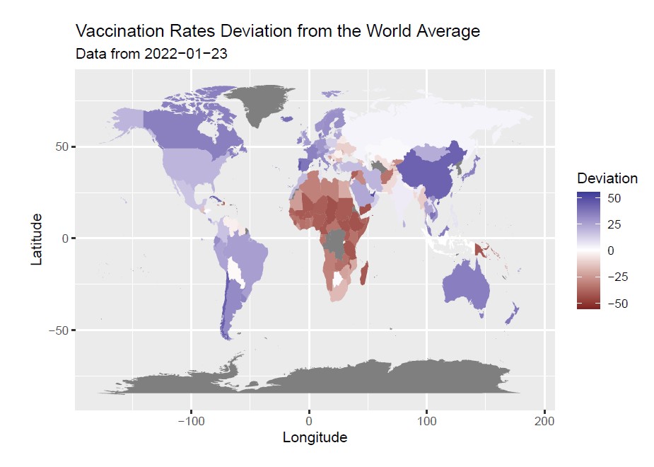

# COVID19 Vaccination Rates Explorative Analysis

Small project for the course [Programming Tools and Technologies for Data Science](http://www.math.ntua.gr/~fouskakis/Programming_R/progr.html) offered by the Master's program in *Data Science and Machine Learning* of the National Technical University of Athens.

The available variables for exploration are the ratios of partially vaccinated and fully vaccinated people in various regions of the world.

[Project Description](docs/assignment.pdf)

[Presentation](presentation.pdf)

[Source Code](presentation.Rmd)
